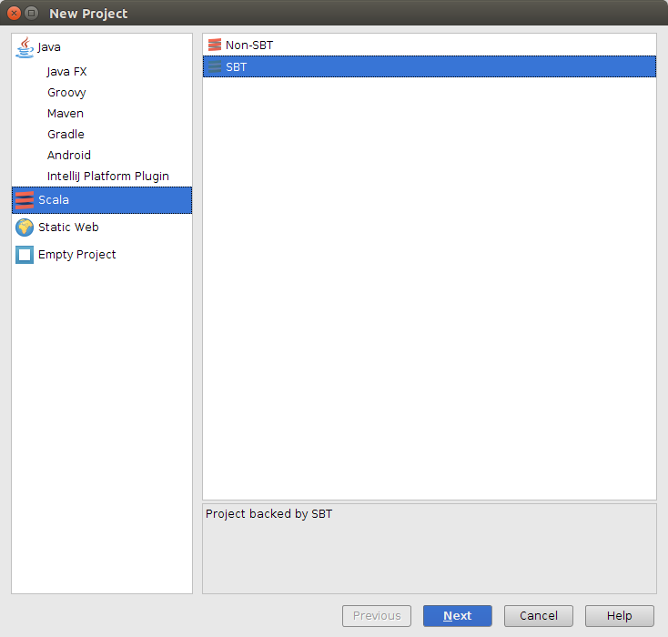
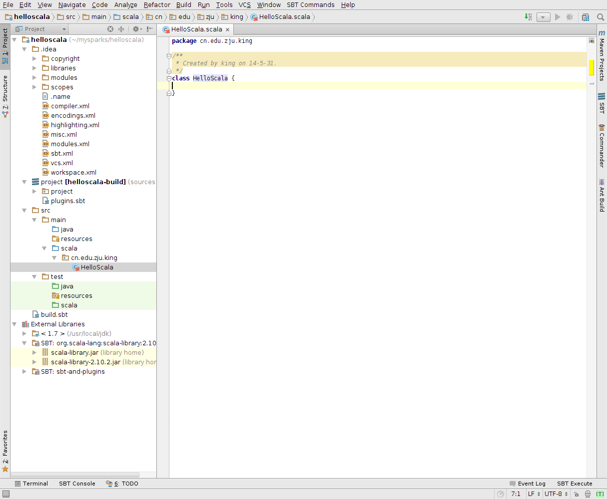

---
layout:	post
title:	Scala & Slick
date:	2014-05-31 18:32:00
categories:	spark
---

Spark基于Scala语言开发，而Scala语言实际上是Java语言的进一步变化形态，外形上变得更像Python,Ruby,Perl等脚本语言，而实际执行效率却与Java极为相近。所以整体Scala语言开发效率极高，同时也对程序员的能力水平要求相应提高。给我的个人感觉就是，这是一门未来会在编程语言顶端层次的语言，会这门语言的人应对的系统也往往是集群式的开发项目，大概也是“低端”的项目用不上Scala（实际上Scala有许多的特性也使得其十分适合集群项目的开发）。

所以，学习Scala是在深入了解Spark之前的必修课。

本文将从以下几个步骤指导Scala的初步上手：
- Scala语法个人学习经验
- IntelliJ IDEA 新建以sbt开发管理的Scala项目
- Scala关于RDBMS的操作（Slick Project）
- Spark开发环境搭建与说明

- - -

<h2 id = "第一节">一、 Scala语法学习</h2>

根据我自己走过来的路子，我觉得下面的四个链接所提供的学习资料最为有用，当然，我自己第一篇文档都没有完全看完～。主要推荐第一篇与第三篇文档，估计看到一半自己便可以开始写些Scala的程序了。

> 1. [Twitter Scala School](http://twitter.github.io/scala_school/zh_cn/index.html)
> 2. [Scala 官网](http://docs.scala-lang.org/)
> 3. [Effective Scala](http://qiujj.com/static/Scala-Handbook.htm)
> 4. [Scala API手册](http://www.scala-lang.org/api/current/#package)

- - -

<h2 id = "第二节" >二、 IntelliJ IDEA</h2>

1. 按照董西成大叔的博客学习，做完准备工作，同时你可以按照说明完成Spark源码的阅读环境，阅读Spark源码能够极大的提升你Scala的学习水平。此处，我们可以选择在安装Scala插件时安装SBT插件

2. 在IDEA中编写自己的Scala项目程序。New Scala Project（using sbt)--> helloscala

3. 之后我们根据maven的习惯建立文件目录结构，在Scala下略做修改之后，我们可以看到，在src/main/目录下划分有java, scala子目录，一般来说maven仅有java路径。此时建议参考Spark源码目录结构，以Spark为标准学习。除此之外，

4. 接着你可以自己按照scala语法自己写一个Hello Scala的程序了。

<h2 id = "第三节" >三、 Slick</h2>

总有一个经验是这样的，你看完了一门新语言的语法基础，然后屁颠颠的开始写这语言的第一个程序，必然选择Hello XXX。同样，在这之后往往就是写再大一点的，行数再多一点的小程序来证明自己算是初步掌握了Scala的开发，这个小程序，又估计基本上都会选择数据库操作来练手。

Slick是Scala语言开发的集成式数据库连接工具集，原名Scala Language Integrated Connecting Kits，就像Spring中我们使用的数据库连接函数库一样，Slick支持所有数据库的开发，甚至于你自己定义的都可以配置。所以根据maven使用经验，我们可以利用sbt来配置管理slick程序的开发。

在做这些之前，我们需要学习Slick的编程方法，这个在其官网上有详细的说明(http://slick.typesafe.com/)

